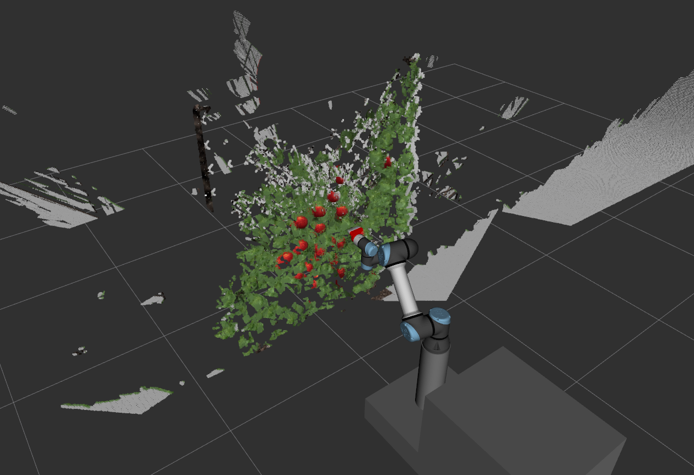
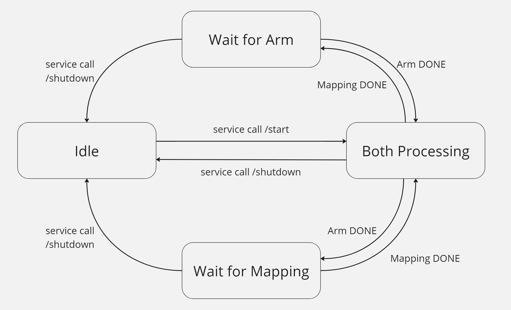
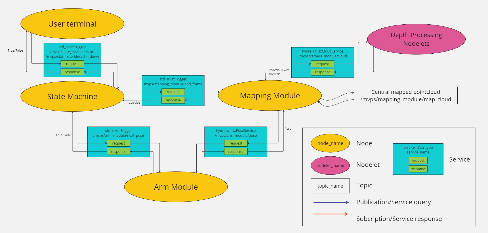
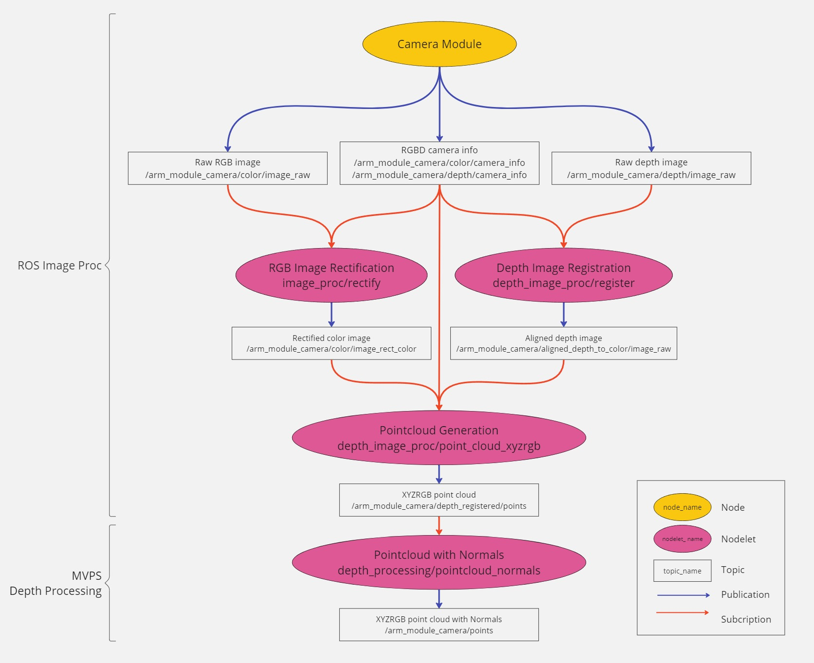

# Apple Picking State Machine
**A module of my capstone - Automation in Apple Picking**

A revised state machine for the active perception set up in the apple picking project - MVPS
It is based on the state machine module in MVPS, with modifications suitable for my capstone in apple scene selective reconstruction.

<p align="center">
  
</p>

## States
<p align="center">
  
</p>

System states:
- `IDLE` The state machine is at rest, waiting for both the arm and mapping services
to be ready. It monitors the availability of these components and confirms that the
necessary services are active before progressing to the next state. This state acts
as a starting or resting phase and can be returned to if the system needs to halt or
reset.
- `BOTH PROCESSING` Both the arm and mapping components are actively engaged
in their respective tasks. The arm is moving to its next goal position, and the
mapping component is processing data or updating the map. This state manages
parallel processing, where both components work simultaneously, and it tracks the
completion status of each component to determine the next transition.
- `WAIT FOR ARM` Occurs when the mapping component has completed its task but the
arm has not yet reached its goal position. In this state, the state machine pauses to
wait for the arm component to complete its movement or processing. Once the arm
signals completion, the state machine can move forward.
- `WAIT FOR MAPPING` Similar to WAIT FOR ARM, this state is triggered when the arm
has reached its goal, but the mapping component still needs more time to complete
its data processing or map update.

The user interacts with the state machine in the following ways:
- Kickstart the pipeline by calling `/start` service: Given successful, it transitions the
State Machine from resting IDLE state to BOTH PROCESSING, and repeatedly functions
through all the cycles before reaching the end of the pose list.
- Halt the system by calling `/shutdown` service: Gracefully shut down the Mapping
and Arm Module.

## ROS Graph
<p align="center">
  
</p>

# Depth Processing
## Depth Image Processing for Gazebo
The realsense_gazebo_plugin outputs the following topics:
- /arm_module_camera/color/image_raw - RGB Image
- /arm_module_camera/depth/image_raw - Depth Image
- /arm_module_camera/color/camera_info and /arm_module_camera/depth/camera_info - Camera Calibration Info
  
## Depth Image Processing for RealSense Camera
Includes the types of topics similar to the Gazebo simulation and some extra topics 

## Image Processing Pipeline
- **RGB Image Rectification - image_proc/rectify**
    - Input: 
      - /arm_module_camera/color/image_raw - Raw RGB image
      - /arm_module_camera/color/camera_info - RGB camera info
    - Output: 
      - /arm_module_camera/color/image_rect_color - Rectified color image
- **Depth Image Registration - depth_image_proc/register**
    - Input: 
      - /arm_module_camera/depth/image_raw - Raw depth image
      - /arm_module_camera/color/camera_info - RGB camera info
    - Output: 
      - /arm_module_camera/aligned_depth_to_color/image_raw - Aligned depth image
- **Point Cloud Generation - depth_image_proc/point_cloud_xyzrgb**
  - Input: 
    - /arm_module_camera/color/image_rect_color - Rectified RGB image
    - /arm_module_camera/aligned_depth_to_color/image_raw - Aligned depth image
    - /arm_module_camera/color/camera_info - RGB camera info
  - Output: 
    - /arm_module_camera/depth_registered/points - XYZRGB point cloud

<p align="center">
  
</p>

# Dependency
`indicators` https://github.com/p-ranav/indicators?tab=readme-ov-file#building-samples 

[Currently not developed completely]

Clone the above header-only library into any directory and export its path
```
export INDICATORS_PATH=/path/to/indicators
```

# MVPS System Setup
## Components
- arm-module-ur5e
- segmentation-module
- MVPS
- apple_picking_state_machine

## Build Individually 
- `MVPS`
```bash
cd MVPS # Location of MVPS in your system 
mkdir build && cd build
cmake ..
make
source ../devel/setup.bash
```

- `model_inference` check out segmentation-module/model_inference

## Build ROS catkin workspace
```bash
cd apple_ws # Your catkin workspace
catkin build
source devel/setup.bash
```

## Launching for Demo
You can launch all components in a single terminal session
```bash
mon launch apple_picking_state_machine unused_capstone_demo.launch 
```

The above launch script launches the following components:

<details><summary><b>Details</b></summary>

- Gazebo Simulation for arm module, including the UR5 robot arm and camera

```bash
roslaunch arm_module_gazebo arm_module_ur5e_bringup.launch 
```

- Depth Processing
```bash
roslaunch arm_module_gazebo depth_processing.launch always_pub_normals:=false filter_pointcloud:=true
```
`always_pub_normals` means always compute and publish pointcloud normals as new pointcloud arrives.
Otherwise it conly publishes in response to service call.

- Arm Module
```bash
roslaunch arm_module_ur5e_moveit_config moveit_planning_execution.launch sim:=true
rosrun arm_module_ur5e_controller run_robot_controller.py
```

- Mapping Module
```bash
rosrun mapping_module mapping_module --config $(rospack find mapping_module)/cfg/dataset.json
```

- State Machine
```bash
rosrun apple_picking_state_machine apple_picking_state_machine
```

- Pointcloud Filter Node
```bash
roslaunch pointcloud_filter_node pointcloud_filter.launch
```
</details>

**NOTE** Sometimes the spawning node for the arm with a specific join value doesn't work properly. Most of the time, 
the Arm Module can then home the simulated arm to that initial configuration. However, if it doesn't work, simply relaunch the 
system.

## Launch the State Machine
```bash
rosrun apple_picking_state_machine apple_picking_state_machine 
```

## Control the system via the State Machine
Starting and shutting down the system can be done by service call to the State Machine 
```bash
rosservice call /mvps/state_machine/start # Start the start machine
rosservice call /mvps/state_machine/shutdown # Shutdown after demo
```
The shutdown service call to the State Machine will result in its exiting the main loop, then calling the corresponding 
shutdown services for Arm and Mapping Module 

Reset the Sim
```bash
rosservice call /gazebo/reset_simulation "{}"
```

# Result
## Filtered
After 11 iterations:
[ INFO] [1730372675.559318782, 849.488000000]: System Execution Time: 832.493 seconds
[ INFO] [1730372675.559331927, 849.488000000]: Arm Module Total Execution Time: 115.254 seconds
[ INFO] [1730372675.559345052, 849.488000000]: Mapping Module Total Execution Time: 831.58 seconds

## Unfiltered
[ INFO] [1730378537.389721974, 1367.301000000]: System Execution Time: 1321.78 seconds
[ INFO] [1730378537.389739447, 1367.301000000]: Arm Module Total Execution Time: 161.553 seconds
[ INFO] [1730378537.389752332, 1367.301000000]: Mapping Module Total Execution Time: 1320.87 seconds
